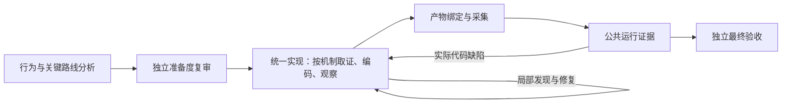

# 按机制推进、在使用处取证的工作流改革

## 决策

目标仍是低成本、高质量完成通用驱动翻译。准备材料的价值取决于是否降低后续决策与返工成本，不以报告长度或检索数量衡量。

采用“粗粒度规划全程，细粒度准备下一步”：提前确定行为范围、关键限制、可行路线和验收方式；局部细节在实际编码时读取。不能让模型为还没选择的方案穷举所有接口，也不能让模型带着会推翻整体方案的假设写大量依赖代码。

## 分析阶段的边界

提前解决错误代价大的问题：主要目标机制是否可用、所有权和执行上下文是否成立、怎样接入真实运行产物、目标端怎样触发并观察要求的行为。先查源码与实际调用点，只有仍存在会改变路线的不确定性才做最小探测。

函数签名细节、局部 helper 选择和普通分支实现可以推迟到使用处。若某签名或局部条件决定主要接口是否可用，则仍属于路线问题，不能借“延后”跳过。未决事项明确影响和查证入口，不为每个函数制造一条待办。

保留完整行为义务和验收断言。短交接只携带关键限制、支持路线的接口证据、未决事项、按依赖排列的机制顺序和义务入口。6–8 千字符是上限写作建议，不是必须填满的配额。不会新建规划报告或引入额外模型整理节点。

## 实现循环

1. 从已有结论确定下一个机制及其可观察结果；证据已够就直接开始。
2. 对当前缺口，一次获取相关原始行为、目标接口定义/调用点、受影响断言。独立查询并行，输出总量有界；已知位置直接读，无需先查索引。
3. 实现完整机制，将适用的失败处理、资源所有权及清理路径一起完成。
4. 用能否定关键假设的最小观察检查：源码、编译、局部执行或真实设备运行。编译不证明硬件行为；也不要求每次编辑启动虚拟机。如果检查依赖相邻机制，就完成最小依赖组再验证，期间保留未验证状态。
5. 在现有报告的当前状态中简记结果、剩余问题和下一机制，然后继续。没有逐机制提交、额外模型轮次或固定格式门禁。

先尽早打通一个真实可观察操作，再扩展剩余要求。这个里程碑不是范围缩减或最终验收。机制依驱动选择：一次存储请求、USB 取消、传感器读取或 GPIO 释放都可能是适当粒度，不要求所有驱动套 DMA/IRQ/网络模板。

## 现场发现问题时

局部实现选择错误在当前工作中修正。观测和根因假设分开，优先补能区分解释的小检查，避免根据一次失败大改架构。

若证据推翻冻结要求、验收断言或路线前提，使用现有 rework/checker 协议，修改受影响结论和依赖，不能静默改弱 oracle。保留不相关正确工作，不重新完整分析。

复审判断实质准备度和真实交付证据，不因为局部细节延后或没有逐函数计划而拒绝。若被延后的问题实质阻止当前可行性结论，则应指出具体后果。最终独立复审、完整必需功能及 managed 执行证据保持要求。

## 工具改动

现有 `knowledge packet` 新增可选参数：

```sh
# 原行为已明确，只查目标接口
... knowledge packet RUN --question 'cancel_transfer ownership' --domains target

# 契约与目标接口需要一起理解，一次返回
... knowledge packet RUN --question 'cancel ownership' --contract-id C-CANCEL --domains obligations target
```

- 默认仍返回四个领域；按需选择不增加工具调用层次。
- 只对请求的领域排名、选取原文；未请求领域标记 `NOT_REQUESTED`，不同于 `NO_LITERAL_MATCH` 和 `BUDGET_OMITTED`。
- 只读契约时不加载代码索引；只查目标接口时不读契约原文。代码索引仍按既有机制验证快照，不以节省输出为由取消证据完整性验证。
- 指定契约编号需要包含 obligations；指定领域查询必须包含对应领域，矛盾请求在读取证据前报清晰参数错误。
- 保持默认 12 KB 总输出预算、每领域最多两个片段、明确截取位置及来源。它仍是字面检索，不能保证语义召回或接口等价。
- 最小调用语法直接放在已提供的工具说明中，不要求为了使用一次检索先读长指南。已编辑的当前源码仍须直接读取，冻结片段不代表当前实现。

## 为什么没有增加控制器节点

每个驱动的合理机制不同。将循环机械拆成“规划→查询→实现→验证→复审”的五个模型节点会增加调用、交接和形式性失败。本轮改变现有节点的任务协议及取证能力，在同一工作会话执行循环，沿用既有验收检查点。

因此这是明确的工作策略与工具支持，不是能强制模型每一步都正确的状态机。离线测试可以证明工具边界和既有流程未损坏，不能证明模型一定遵守顺序或预算下降。

## 验证与下一步

本轮不启动付费迁移。回归覆盖领域选择、无结果与未查询的区别、字节预算、一次跨领域读取、证据完整性失败、CLI 参数传递、已有分析/交付/复审/压缩及端到端流程。

之后从相同输入 checkpoint 对照，统计到首次真实操作的成本和时间、前面已有结论却再次犯错的返工、重复检索/大范围改写，以及完成同等功能的总费用。不能以费用从实现阶段移到框架阶段作为降本证据。

实现分支：`fix/delivery-workflow-audit-20260927`，隔离工作树 `driver-port-factory-delivery-fix-20260927`。未将代码热更新到活动实验。

按需取证改动的首轮回归：**117 项通过**，其中问题证据包 31 项（新增 14 项）；节点重构的最终全量结果另记于文末。全 src/tests 的 Ruff F 与 git diff --check 通过。没有新增付费模型调用，未声称实测成本降幅。

## 执行图：删除重复框架节点

旧 `target_framework_enablement` 仍拥有独立模型调用、报告、快照、恢复路径和最终复审输入，但其责任已扩展成完整交付，与 `driver_implementation` 重叠。因此删除这个独立节点，统一由 `driver_implementation` 负责框架适配、驱动、集成、运行产物和公共 harness。



图展示主要责任，不把机械获取、索引、登记等节点画成模型任务。分析准备与复审仍保留；获取和索引不是独立语义分析代理。一个机制循环不新增节点。

删除内容包括框架阶段枚举与图依赖、服务及验证器、单独报告/清单/快照类型、模型任务配置、阶段路由和专用恢复路径。最终验收绑定统一实现的完整源码清单，而不是再检查过时的框架中间快照。上下文切换点改为分析到唯一实现节点。成本统计仍识别历史框架日志用于旧/新成本比较，此名称不再是可执行节点。

保持实际保护：统一实现接受前仍经过功能 smoke；源码变化检测覆盖所有修改路径，框架/集成路径没有豁免；产物、公共执行和最终独立复审仍绑定当前证据。完整准备和已确认的运行结果继续复用，缺失时仍在相关任务中补齐。

这是真实执行图变化，不兼容旧项目数据库的节点布局。当前活动实验继续使用原工作树，不迁移、不热更新。新流程需新项目运行；若做相同输入对照，应导入相同冻结输入到新项目，不直接把旧数据库当新流程续跑。

节点重构最终验证：完整离线套件共 **297 项**，首轮 295 项通过，2 项失败仅因获取测试仍断言旧图为 18 个节点；更新为 17 后，这两项重跑通过。另有 11 项结构性回归通过，覆盖统一源码漂移、分析到实现交接、实现接受后的准备记录丢失恢复，以及三种迁移模式的执行图。全 src/tests Ruff F 和 git diff --check 通过。没有启动真实模型迁移；删除节点不等于省去该节点原有全部费用，其必要工作已归入统一实现。

## 中途执行不再等待完整套件

继续核对实际执行入口时发现：原 `run_cases` 在执行任何用例前，会验证整个 experiments.json 的所有脚本存在。这会让“第一个机制已就绪、后续机制仍在写”受到完整套件准备条件的阻挡。

现在 `experiment run RUN --suite --only-case ID`（可重复选择一个最小依赖组）只检查和运行选中的用例，使用原有 case ID、依赖绑定、执行 receipt 和日志。未选中的后续脚本可以尚不存在；全局 case ID 仍需唯一，选错 ID 会在执行前给出明确错误。返回值明确标记子集执行，不产生整套完成声明。

最终 controller `run_suite` 没有子集选项，仍验证并采集全部声明用例。早期证据仅在原有输入身份匹配时复用；后续代码/运行产物变化使相关证据失效时照常重测，不把早期 PASS 当最终 PASS。

早期探索中的失败也不应强迫模型重跑已被替代的诊断。`experiment acknowledge RUN --job-id JOB --report PATH --only-case ID` 可明确确认已观察的特定成功用例；不能确认失败或未观察用例。所有失败 receipt 继续保存。最终采集要求 acknowledgment 覆盖实际完整公共执行的每一个 receipt，所以子集确认不能省略最终必需的失败用例。

该机制不增加模型调用，不新增“每函数测试”要求。使用统一实现会话：完成一个有意义的机制，运行其最小有效检查，利用结果修正下一步，再继续编码。当前离线测试验证这种顺序能够实际执行、复用和恢复；模型是否在真实迁移中持续采用它，仍需后续对话与执行时间线验证。

中途执行改动验证：新增 4 项真实本地执行/绑定回归，与已有修复、端到端交付及实现 smoke 一起，共 **49 项通过**。Ruff F 与 diff 检查通过；没有进行新的付费模型实验。

## 保持“下一步”的连续性

为避免压缩/续跑后只剩完整契约或旧失败，交付任务提供 `tool_runtime.current_work_report`，指向同一个 `.dpf-output/report.md`。这就是最终提交的报告，不另建进度报告。工作者在顶部用短 Current status 记录当前机制、影响下一次改动的问题、最新观察/receipt 和下一步，在有意义的证据变化后更新。

每次准备交付工作者调用时，控制器重新读取这个可选报告，最多内联 2,400 字符的完整段落并保留不可变全文引用；只识别当前状态段，不加载历史诊断。相同内容在同一会话去重，报告更新或压缩/新会话后重新提供。英文/中文状态标题可识别，缺少标题、过大或无法读取只退回原有证据入口，不产生格式返修。独立最终复审不自动注入这份工作进度。

这些都是工作者主张，不是程序验证结果；现场证据和冻结要求仍优先。模型在一次原生调用内自行压缩时，可以从已知固定路径重读最新状态；控制器不会声称能在原生调用内部实时插入上下文。

最终合并验证：完整离线套件 **305 项全部通过（396.46 秒）**；Ruff F 与 diff 检查通过。小型真实模型试验与旧 E1000 暂停记录见 [暂停与测试报告](E1000_STOP_AND_REFORM_TESTS_2026-09-27.zh-CN.md)。小试验通过功能检查，但没有证明分段编码/验证行为。
