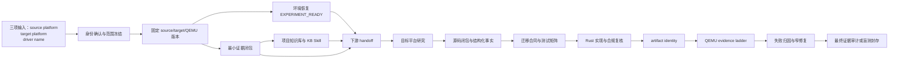

# 问题一：C-to-Rust 内核驱动迁移工作流对照

## 1. 报告范围和结论

本报告回答两个问题：

1. `C-kernel-to-Rust` 原版 Skill 要求怎样的迁移流程；
2. 当前 `driver-port-factory`（DPF）流程与原版相比增加、合并或改变了什么。

对照的规范源是本仓库实际使用的原版 Skill：

- [`open-kernel-driver-port/SKILL.md`](/home/unix/file/C2R-Driver/C-kernel-to-Rust/skill/open-kernel-driver-port/SKILL.md) 及其 acquisition、environment-recovery、knowledge-bootstrap、handoff、intake references；
- [`knowledge-guided-driver-port/SKILL.md`](/home/unix/file/C2R-Driver/C-kernel-to-Rust/skill/knowledge-guided-driver-port/SKILL.md) 及其 workflow、target-platform-study、translation、test-porting、qemu-evidence references；
- 如需正式盲测，再由 [`blind-c2rust-driver-evaluation/SKILL.md`](/home/unix/.codex/skills/blind-c2rust-driver-evaluation/SKILL.md) 负责策展、封存和独立评测。

结论可以先概括为：

- 原版 Skill 是**证据和技术工作的规范流程**。它要求先确认驱动身份和范围，再固定版本、取得最小证据闭包、建立可追溯知识库、研究目标平台、建立迁移合同、实现 Rust、准备真实产物，最后按 QEMU evidence ladder 验证并审计。
- DPF 是**执行这些规范的控制器**。它增加了可持久化阶段、typed artifact、SQLite ledger、CAS、哈希和工具提交协议，把“模型声称完成”改成“文件、工具收据和确定性 validator 共同决定状态”。
- DPF 把原版约 12 个逻辑阶段拆成开发模式下的 17 个控制阶段，增加了 clone 前的细粒度 intake、独立分析审查和独立最终功能审查；同时把 source closure、迁移合同和测试计划合并为一个 `migration_contracts` 任务，并在普通开发模式省略单独的 `completion_audit` 阶段。
- 这些变化不是全部等价替换。当前追踪矩阵明确标出一些要求仍是 `PARTIAL` 或 `PLANNED`，尤其是完整源语义证据、证据闭包、artifact identity、QEMU ladder 和最终证据审计。因此汇报时应说“DPF 按原版 Skill 对齐并执行”，不能说“所有 Skill 门禁已经完全实现”。

## 2. 原版 Skill 的总体流程

原版由两个迁移 Skill 串接组成：`open-kernel-driver-port` 负责把问题从用户输入引导到一个有版本、有证据、有可执行路线的迁移任务；随后把结果交给 `knowledge-guided-driver-port`，后者负责真正的跨平台驱动迁移、测试适配、产物准备和 QEMU 验证。

### 2.1 `open-kernel-driver-port`：启动和证据准备

**第一步是硬 intake gate。** 必须有 `source_platform`、`target_platform` 和一个能唯一确定源驱动、设备族及总线范围的 `driver_name`。如果名称可能对应多个驱动、总线或设备族，只允许做轻量候选发现，不得先 clone 内核、下载手册或准备工具链；应一次性向用户列出候选并确认。这个状态要持久化为 `UNRESOLVED -> ONE_QUESTION_ISSUED -> WAITING_FOR_USER -> CONFIRMED`，不能因重启或上下文压缩重复提问。

**第二步是版本和来源获取。** 在身份确认后，选择并固定 source、target、QEMU 的精确 tag 或完整 commit，优先复用经过验证的本地缓存。采集的不是一个孤立 C 文件，而是源驱动入口递归依赖的共享核心、头文件、配置和生成输入，目标平台相关 API、相似驱动、生命周期和打包路径，QEMU 设备模型，硬件手册，测试和工具链。每个受控材料要有来源、版本、工作区路径、原始/派生关系和 SHA-256；上游源文件保持只读。

**第三步是环境恢复。** Skill 明确禁止把“没有常规 build 命令”当作终点。应依次检查已有 runner/cache、官方 container/SDK/release image、component/module/image injection、CI 或 release 自动化，以及必要时的完整源码构建。环境阶段必须真正执行一次相关 source、target 或 device-model/QEMU 实验并留下输出和退出/超时结果，形成 `EXPERIMENT_READY`。这只证明实验路线能运行，不等于当前迁移驱动已经进入目标产物；后者单独称为 `MIGRATED_DRIVER_RUNTIME_READY`。

**第四步是本地知识库。** 知识库是持续的证据接口，不是一次性的调研报告。它要支持完整性状态、搜索、精确取证、原始文件/页码回看和重建。索引失效或检索不到预期目标 API 时，应直接检查固定版本的目标源码，补充受控原文、重建索引并复测。目标专项 probe 至少覆盖注册/匹配/生命周期、MMIO/PIO/DMA、IRQ/延迟工作、锁和分配上下文、错误恢复、安全 Rust、相似驱动以及 component/镜像/QEMU 路径。最后生成项目专用 KB Skill，并把环境、证据和知识库一起 handoff 给下游 Skill。

### 2.2 `knowledge-guided-driver-port`：迁移本体

下游 workflow 的逻辑阶段如下。它们是技术职责，不要求每个阶段必须由单独 AI 调用完成。

| 逻辑阶段 | 主要任务 | 进入下一阶段的证据门 |
|---|---|---|
| 0. migration envelope | 固定平台、设备/总线/架构、排除变体、版本、工具链、驱动路径、目标改动候选、artifact mode、QEMU 路线、生命周期和完成标准 | 范围、版本和交付模型明确 |
| 1. evidence/environment/baselines | 用 KB 验证硬件、源、目标、QEMU；建立 source baseline 和未修改 target baseline；在目标路线失败时继续执行 QEMU/device-model/source smoke | 有足够证据且至少有一条真实实验路线 |
| 2. target-platform study | 从目标原始源码和原始文档完成 profile、API evidence table，并端到端追踪一个相似驱动 | 每个目标 API 有定义、调用点、上下文、所有权、错误和安全证据 |
| 3. source scope closure | 从入口递归闭包共享核心、头、宏、配置、callback、注册表、条件编译和测试依赖；固定 translation units 和 compile commands | 所有行为相关源事实都有来源，缺失事实不能猜 |
| 4. migration contracts | 对硬件、C 行为、目标 API、QEMU 可观测性和 Rust 设计建立稳定合同；状态区分 `VERIFIED/INFERRED/UNKNOWN` 与执行状态 | 每项行为都有验证 oracle 或明确 blocker |
| 5. test porting | 对源测试做 `RETAIN/ADAPT/EXCLUDE/PRESERVE_BLOCKED` 分类，保留输入、oracle、边界、负路径、清理和 provenance | 测试意图和断言来源可追溯 |
| 6. Rust implementation | 按寄存器/状态、资源、注册和 probe、TX/RX、IRQ/延迟工作、生命周期/错误/恢复顺序实现；适配公开测试 | 实现、测试和必要目标改动完成 |
| 7. target compliance review | 再查 KB 和目标原文，核对风格、API、架构层、feature、unsafe、锁/IRQ/分配、错误、生命周期、日志和文档；修复后重复 | 代码和目标改动符合目标规则 |
| 8. artifact/QEMU ladder | 证明 base/payload/final artifact identity，再按环境、静态、产物、驱动 presence、probe、TX/RX、IRQ、测试、边界恢复、regression 的顺序推进 | 每个更强结论都有前一级证据，失败 run 不覆盖 |
| 9. attribution/repair | 把失败归为驱动、测试、harness/包装、源平台假设、目标平台、QEMU、环境或证据不足；只做最低范围修复并重跑受影响门 | 失败原因和修复证据一致 |
| 10. blind candidate sealing（可选） | 在公开修复结束后冻结源码、补丁、artifact、公开测试、能力表和 provenance，导出 candidate digest；迁移者不能接触私有断言 | 生成不可变候选 |
| 11. final evidence audit | 交付固定输入、源码闭包、合同、测试矩阵、目标合规、产物身份、全部 QEMU run、失败归因和边界声明 | 各合同分别报告，不能把混合结果汇总成乐观 PASS |

这里有三个原版的关键证据边界：

1. **编译通过不是驱动正确，QEMU boot 不是 probe，QEMU 不是实机。**
2. **source baseline、target baseline 和 standalone QEMU/device-model 只能证明各自的范围。** 只有能证明当前迁移驱动确实进入 artifact 的运行，才可以支持 migrated-driver runtime claim。
3. **状态和证据分开。** `PASS` 只能表示满足冻结 oracle；`NOT_RUN`、`BLOCKED`、`QEMU_MODEL_BLOCKED`、`INCONCLUSIVE` 不能被报告措辞提升为成功。

## 3. DPF 的实际流程

DPF 的开发模式当前采用 17 个控制阶段，按四个大阶段组织。阶段顺序和职责见 [`docs/STAGE_GUIDE.md`](STAGE_GUIDE.md)，可执行 DAG 由 [`src/driver_port_factory/orchestration/migration.py`](../src/driver_port_factory/orchestration/migration.py) 生成。

| 序号 | 控制阶段 | 大阶段 | 执行者 | 主要职责和输出 |
|---:|---|---|---|---|
| 1 | `project_init` | scope_and_baselines | 静态控制器 | 建立项目 manifest、角色、模式和控制配置 |
| 2 | `request_intake` | scope_and_baselines | 静态控制器 | 保存原始请求及三项必需输入 |
| 3 | `driver_candidate_resolution` | scope_and_baselines | hybrid | 只做轻量元数据候选发现，不提前 clone |
| 4 | `scope_confirmation` | scope_and_baselines | hybrid/用户门 | 唯一确认驱动、设备、总线、包含和排除范围 |
| 5 | `migration_envelope_freeze` | scope_and_baselines | 静态控制器 | 封存迁移边界和身份记录 |
| 6 | `repository_acquisition` | scope_and_baselines | hybrid | 选择并获取 source/target/QEMU，建立 baseline locks、source identity 和 target working tree |
| 7 | `evidence_closure` | evidence_and_design | hybrid | 选择 source/target/QEMU/hardware/test/tooling 六域材料，控制器获取原文、哈希、provenance、coverage、gap 和 retrieval ledger |
| 8 | `environment_recovery` | evidence_and_design | hybrid | 发现 artifact mode，登记不可变实验 route，真实执行并形成 `EXPERIMENT_READY` |
| 9 | `knowledge_base` | evidence_and_design | 静态控制器 | 从不可变 materials manifest 建立/验证索引、query contract、项目 KB Skill 和 readiness report |
| 10 | `target_platform_study` | evidence_and_design | Codex + validator | 输出 target profile、API evidence、analogous trace、packaging 和 target-change plan |
| 11 | `migration_handoff` | evidence_and_design | 静态控制器 | 把前置证据绑定成下游不可变 handoff |
| 12 | `migration_contracts` | evidence_and_design | hybrid/worker | 在一份报告中完成源码分析、源语义问题取证、迁移合同和测试计划 |
| 13 | `analysis_review` | evidence_and_design | 独立 AI | 在实现前一次性审查目标研究、源码分析、合同和测试 provenance；核心结论及问题都引用精确位置 |
| 14 | `driver_implementation` | delivery | Codex worker | 生成 Rust、适配公开测试、必要最小集成改动、compliance report 和 implementation snapshot |
| 15 | `artifact_preparation` | delivery | hybrid | 生成/注入 runtime artifact、presence checker、variants 和 artifact identity；包装问题与源代码问题分流 |
| 16 | `public_qemu_validation` | delivery | hybrid/worker + controller | worker 编写 harness；工具请求 `PUBLIC_QEMU`；控制器保存 immutable receipt；worker 解释 oracle、归因并自检 |
| 17 | `public_repair` | delivery | 独立 AI | 对原始需求、实际源码、产物、测试和 QEMU 日志做最终功能审查，集中返回全部实质问题 |

普通 `DEVELOPER_EVIDENCE` 流程在第 17 阶段结束；`completion_audit` 主要出现在 blind candidate 的封存后 DAG，而不是普通开发模式的额外第 18 步。

### 3.1 DPF 的状态、产物和控制边界

DPF 与“让模型在聊天里返回一个 JSON 状态”不同：

1. 模型把报告、选择文件、脚本和其他交付物写入当前工作区。
2. 模型调用唯一的 `dpf codex submit`/`tool_runtime.submission_command` 提交接口。
3. 控制器验证 job identity、文件哈希、阶段、artifact schema、required output cardinality 和 bundle。
4. 合法产物进入 SHA-256 CAS；stage occurrence、状态和 ledger 在一个持久化事务中提交。
5. 模型最终聊天回复只作为活动说明，不改变工作流状态。

必需输出和过程证据分开：required artifact 必须在完整 bundle 校验后才能把阶段置为 `PASS`；attempt、Prompt、原始 Codex result 和 event log 是 auxiliary evidence，不能凭空补齐必需输出。阶段状态 `PENDING/READY/RUNNING/WAITING_FOR_USER/PASS/FAIL/BLOCKED/INCONCLUSIVE/NOT_APPLICABLE` 与合同里的证据/执行状态分开保存。

### 3.2 DPF 的审查和修复

DPF 开发模式使用两个持久角色会话：worker 负责研究、实现、执行后解释和修复；reviewer 在第 13 步做独立分析审查，在第 17 步做最终功能审查。两处不是同一阶段重复自审：

- 第 13 步只审查实现前的证据和设计是否足够，发现源材料问题回 `evidence_closure`，目标 API/调用链问题回 `target_platform_study`，C 事实/合同/测试断言问题回 `migration_contracts`。
- 第 17 步直接核对原始功能要求、实现、测试、产物和原始运行日志；它不把启动成功推断为驱动成功，也不把未执行的测试算成通过。
- 修复沿用原 worker 和 reviewer 会话，但每一次源代码、包装或 harness 改动都需要新的快照、受影响检查和新的运行证据。

修复还受四个大阶段封存约束：自动回退只能在当前尚未封存的大阶段内发生；跨大阶段需要显式 `phase-reopen`。阶段进入历史会参与封存判断，不能靠重启或把状态改回 `PENDING` 绕过边界。这个约束比上游 Skill 的“返回最小受影响 gate”更严格，目的是防止已经使用过的下游输入被静默改变。

## 4. 两套流程的核心对应关系

| 原版 Skill 的技术职责 | DPF 对应阶段 | 变化性质 |
|---|---|---|
| hard intake 和唯一驱动确认 | 1–5 | 拆细；增加可持久化候选和一次性用户问题 |
| revision、材料、provenance | 6–7 | 由模型选择、控制器实际下载/校验/哈希/登记 |
| environment recovery | 8 | 保留 Skill 的 `EXPERIMENT_READY` 与非终止恢复原则，增加 route/attempt validator |
| KB bootstrap 和 query contract | 9，目标 probe 在 10 | 静态基础设施与语义研究分离；不另设 probe agent |
| migration envelope | 5、11 | envelope 先冻结，handoff 再绑定实际前置输入 |
| target-platform study | 10 | 基本一一对应，并加原文行号、API call-site 和 target-change 校验 |
| source scope closure | 12 | 没有独立阶段，合入 worker 的 `migration_contracts` 报告 |
| migration contracts | 12 | 基本对应，但和 source analysis/test plan 共用一份报告 |
| public test porting | 12、14 | 先在合同阶段定 provenance/矩阵，再在实现阶段适配 |
| Rust implementation | 14 | 基本对应，增加 snapshot 和 compliance/target-change inventory |
| target compliance review | 14 worker self-check | 没有单独独立 AI 节点；实现 worker 负责自检，当前追踪状态仍为 `PARTIAL` |
| artifact preparation | 15 | 产物、variants、presence checker、hash identity 程序化登记 |
| QEMU evidence ladder | 16 | harness 与 controller receipt 分离，失败 attempt 不覆盖 |
| failure attribution and repair | 16 worker + controller routing + 17 reviewer | 增加明确 repair target、阶段封存和抗重复停滞规则 |
| final evidence audit | 17（开发）或 `completion_audit`（blind） | 开发模式由独立最终审查替代单独静态 completion stage |
| blind candidate seal | blind-only sealing DAG | 增加 role-specific curator/evaluator/auditor 和 candidate digest 约束 |

## 5. 主要差异及其实际影响

### 5.1 DPF 把自然语言流程变成了可验证状态机

原版 Skill 可以指导一个有经验的 AI 按顺序工作，但 Skill 本身不负责保存 SQLite 状态、检查提交文件、计算 artifact occurrence 或阻止模型绕过阶段。DPF 的 `WorkflowDefinition` 为每个阶段声明依赖、owner、required/auxiliary outputs 和 validator；CAS 保存内容身份，stage occurrence 保存“该内容在什么阶段、以什么 ordinal 出现”，ledger 保存状态迁移和哈希链。

因此 DPF 可以拒绝以下情况：报告存在但必需文件不存在、文件已在提交后改变、required output 数量不正确、来源/版本不匹配、阶段依赖未通过、模型直接把阶段标成 PASS，或旧成功结果与新输入混用。代价是控制器、schema、账本和恢复逻辑增加了工程复杂度。

### 5.2 DPF 的阶段更细，但迁移设计阶段更合并

clone 前的 intake 在原版是一个硬 gate，在 DPF 被拆成 1–5，便于显示“当前是在等用户确认、解析候选还是冻结范围”。相反，原版的 source closure、contracts、test porting 是 3、4、5 三个逻辑阶段，DPF 把它们放进第 12 步同一个 worker 任务。这样减少了模型调用和重复上下文，但也意味着第 12 步的报告必须同时满足三类内容；不能因为合同写好了就假定源码闭包或测试 provenance 已完成。

### 5.3 完整 C 结构化事实被改成按问题取证

原版 `knowledge-guided-driver-port` 将 AST/CPG/CFG、编译命令、布局、调用目标、全局效果和 source spans 作为源语义闭包的重要输入；缺失结构化事实不能猜测。当前 DPF 的 `job.md` 和 [`docs/SOURCE_DESIGN.md`](SOURCE_DESIGN.md) 明确采用用户授权的成本优化：只有具体语义不确定性才运行最小的预处理、类型/布局、ABI 或效果探测，不强制生成全量 C 结构化索引。

这降低了前置存储、索引和模型阅读成本，但它是明确的规范差异，并非原版要求已经完全实现。其质量前提是：每个实际影响合同的疑点都必须得到有界探测或被标记为 blocker；“没有跑全量分析”不能变成“模型可以凭名称猜语义”。追踪矩阵因此把这一项标为 `USER_POLICY_OVERRIDE`，而合同和翻译覆盖仍是 `PARTIAL`。

### 5.4 DPF 新增了实现前和交付后的独立 AI 审查

原版迁移 Skill 定义了审查内容，但普通开发流程没有要求另起一个 reviewer 节点。DPF 增加：

- `analysis_review`：在设计封存前检查目标 API 原文、源分析、合同、测试断言和 QEMU/目标边界；一次集中返回全部实质问题，并使用只读 Python locator 读取冻结源码的精确行号。
- `public_repair`：在 QEMU 运行后从原始需求和实际日志重新核对最终功能，独立决定通过、回退或真实阻塞。

这样可以把“设计错误”和“实现/运行错误”分开，也避免 worker 在自己的报告里把计划或自检写成最终功能通过。代价是两次独立审查调用和更长的总流程；DPF 通过复用 reviewer 会话、集中反馈和只审查变更范围控制成本。

### 5.5 DPF 的回退比原版更严格

原版允许后续阶段发现早期假设错误时，回到最小受影响 gate 并更新记录。DPF 保留“回到最小责任阶段”的原则，但增加大阶段封存：一旦 delivery 已经开始，不能自动回到 evidence/design；必须显式授权 phase reopen。这样防止实现或 artifact 已经使用的输入被悄悄替换，也防止“第 10–13 步反复回退”绕过阶段边界。

代价是某些真实的跨阶段前提错误需要显式恢复操作，不能由普通 `rework --repair-stage` 自动处理。收益是历史输入、阶段通过状态和修复原因保持可审计。

### 5.6 DPF 把 QEMU 运行拆成计划、操作收据和解释

原版要求每次 QEMU run 有冻结计划、唯一目录、实际命令、身份、日志、oracle、退出码和归因。DPF 除了这些内容，又把运行拆成三步：worker 写 harness，调用 `operation PUBLIC_QEMU`；controller 执行脚本并冻结 attempt receipt；worker 检查 receipt、填写同一报告并提交最终决定。这样能区分“没有执行”“harness 失败”“驱动未进入 artifact”“QEMU 未观察到设备”和“驱动 oracle 失败”。

实际实验中，`docker_exit_status=137` 且没有 `RTL-8029` probe marker 时，attempt 保持 `FAIL/INCONCLUSIVE`，不能被报告文字改写成 PASS；之后工作流回到源代码或包装责任阶段。这个行为正是 DPF 想要提供的证据边界，而不是把 QEMU 启动当成驱动成功。

### 5.7 普通开发模式的最终审计节点不同

原版 workflow 明确列出 `final evidence audit`。DPF 的普通开发 DAG 在 `public_repair` 结束，独立 reviewer 把最终功能审查报告作为交付结论；`completion_audit` 主要给 blind candidate 的封存后时序。两者目标相近，但产物、状态和审计入口不同。汇报时应把 `public_repair` 称为“开发模式最终独立功能/证据审查”，不要把它描述成原版 `completion_audit` 的完全同名实现。

### 5.8 盲测不属于普通迁移成功

原版迁移 Skill 允许 `BLIND_CANDIDATE`，但真正私有测试由独立的 blind evaluation Skill 负责。DPF 为此增加 curator、evaluator、auditor 的角色 DAG、candidate manifest、digest 和 transfer，但当前追踪矩阵仍把私有 bundle 隔离、外部 commitment、候选封存和 evaluator gate 等若干项目列为 `PARTIAL` 或 `PLANNED`。普通 `DEVELOPER_EVIDENCE` 的公开测试和 QEMU 结果不能写成独立盲测结果。

## 6. 成本和质量取舍

### 降低成本的设计

- 把 source closure、contracts、test plan 放入一个第 12 步任务，减少重复加载和重复报告。
- 对 C 语义使用问题驱动的最小编译器/预处理/布局探测，不为所有任务强制生成大规模全量索引。
- 静态阶段由控制器完成，不为每个机械门禁启动模型。
- 分析审查和最终审查使用持久 reviewer 会话；审查一次集中反馈所有实质问题，不为每个问题单独启动一轮。
- 已通过阶段的 receipt、CAS artifact 和匹配的工作报告可以复用；未变化的成功 receipt 不因重启重复执行。
- 自动压缩和按 `call_reason` 统计 token/费用，避免把完整历史重复发送给模型。

### 提高质量的设计

- clone 前身份确认和范围封存，降低“迁移了错误总线/设备”的风险。
- 固定 source/target/QEMU revision、材料哈希和 artifact identity，避免 stale code 或 stale image 混入运行。
- 目标 API 必须有原始定义、调用点和相似驱动证据；KB 搜索为空不能直接证明目标没有能力。
- 独立 `analysis_review` 在代码生成前发现错误的目标映射、合同或测试来源。
- QEMU attempt 不可覆盖，证据状态和执行状态分离，失败不能被报告措辞升级成 PASS。
- 大阶段封存、repair target 和停滞保护，避免无边界回退、重复 QEMU 和无效费用。
- public developer evidence、blind private assertions、curator/evaluator/auditor 的角色边界分离。

### 必须如实报告的成本/质量风险

成本优化可能使某些原版硬门变弱。当前 [`docs/SKILL_TRACEABILITY.md`](SKILL_TRACEABILITY.md) 明确列出：完整 revision/baseline 隔离、六域 evidence closure、KB 完整能力、handoff、迁移合同、测试 provenance、artifact insertion proof、完整 QEMU ladder、公开失败修复和最终合同审计仍有 `PARTIAL` 或 `PLANNED` 项。特别是“按需取证”只有在实际问题覆盖完整时才安全；不能把“没有生成全量索引”宣传成“源码语义已经完整覆盖”。

## 7. 适合汇报的最终表述

可以这样概括：

> 原版 `C-kernel-to-Rust` Skill 定义的是从驱动身份确认、证据获取、目标平台研究、源码闭包、迁移合同、Rust 实现到 artifact/QEMU 验证的证据驱动技术流程。我们的 DPF 在不改变这些核心技术边界的前提下，把它实现为一个由控制器管理的 17 阶段工作流：模型只写文件并通过工具提交，程序负责状态、哈希、证据、运行收据和阶段门禁；同时增加实现前的独立分析审查和交付后的独立功能审查。为了兼顾成本，我们合并源码分析/合同/测试计划，并按具体语义问题执行编译器探测；为了保持质量，我们保留原始证据、目标 API 追踪、QEMU evidence ladder、失败不可覆盖和独立审查。当前流程已经建立了完整的执行骨架，但若要声称完全满足原版 Skill，还需要完成追踪矩阵中的 `PARTIAL/PLANNED` 门禁，尤其是源语义覆盖、artifact insertion proof、完整 QEMU ladder 和最终证据审计。

## 8. 主要依据

- 原版入口与 handoff：[`open-kernel-driver-port/SKILL.md`](/home/unix/file/C2R-Driver/C-kernel-to-Rust/skill/open-kernel-driver-port/SKILL.md)、[`references/handoff.md`](/home/unix/file/C2R-Driver/C-kernel-to-Rust/skill/open-kernel-driver-port/references/handoff.md)
- 原版环境和知识库：[`environment-recovery.md`](/home/unix/file/C2R-Driver/C-kernel-to-Rust/skill/open-kernel-driver-port/references/environment-recovery.md)、[`knowledge-bootstrap.md`](/home/unix/file/C2R-Driver/C-kernel-to-Rust/skill/open-kernel-driver-port/references/knowledge-bootstrap.md)
- 原版迁移 workflow：[`knowledge-guided-driver-port/references/workflow.md`](/home/unix/file/C2R-Driver/C-kernel-to-Rust/skill/knowledge-guided-driver-port/references/workflow.md)
- 原版目标平台和运行证据：[`target-platform-study.md`](/home/unix/file/C2R-Driver/C-kernel-to-Rust/skill/knowledge-guided-driver-port/references/target-platform-study.md)、[`qemu-evidence.md`](/home/unix/file/C2R-Driver/C-kernel-to-Rust/skill/knowledge-guided-driver-port/references/qemu-evidence.md)
- DPF 阶段和职责：[`docs/STAGE_GUIDE.md`](STAGE_GUIDE.md)、[`docs/WORKFLOW.md`](WORKFLOW.md)
- DPF 架构和状态/产物边界：[`docs/ARCHITECTURE.md`](ARCHITECTURE.md)、[`docs/CODEX_JOBS.md`](CODEX_JOBS.md)
- DPF Skill 追踪矩阵：[`docs/SKILL_TRACEABILITY.md`](SKILL_TRACEABILITY.md)
- DPF 源码与成本策略：[`docs/SOURCE_DESIGN.md`](SOURCE_DESIGN.md)
- DPF 分析审查：[`docs/ANALYSIS_REVIEW.md`](ANALYSIS_REVIEW.md)
