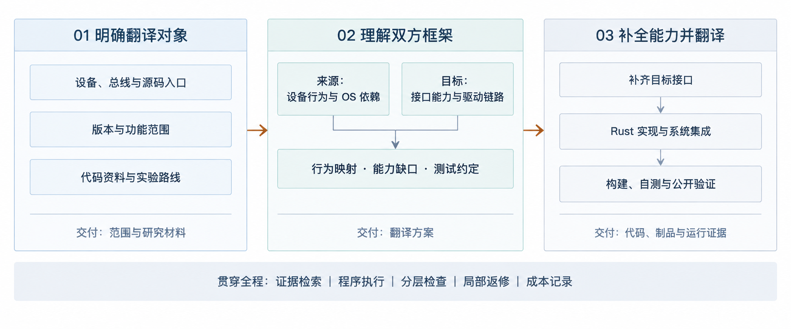
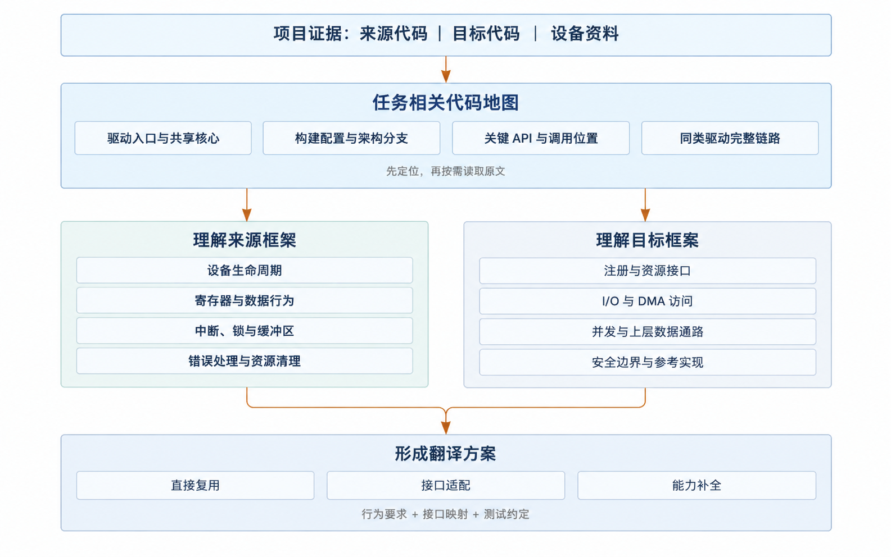
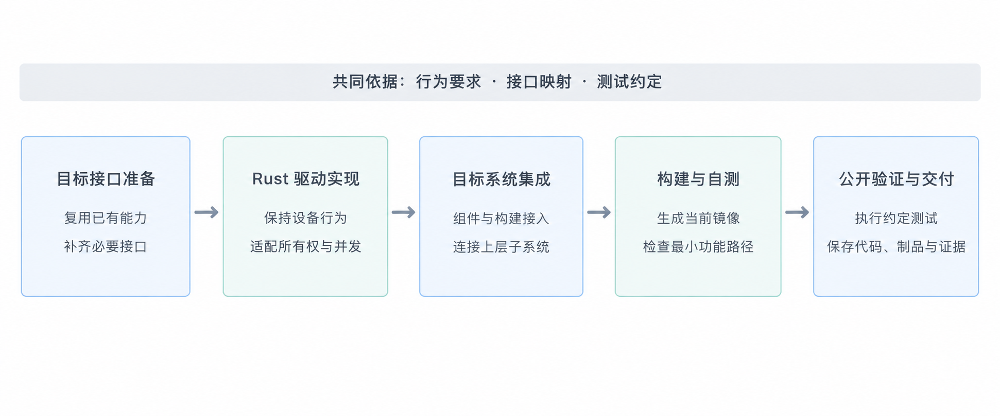
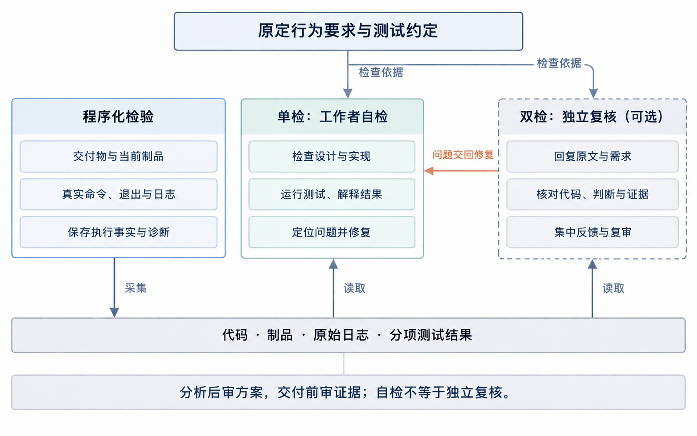
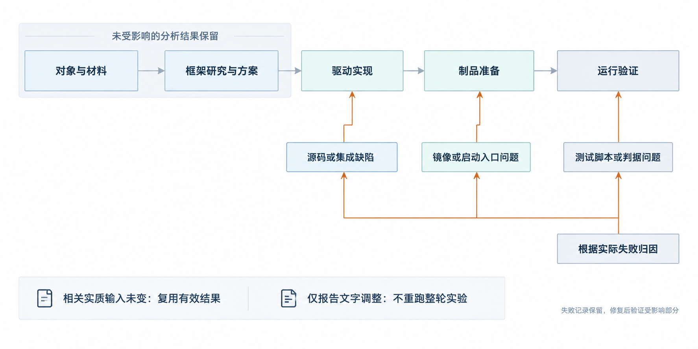

# OS 驱动翻译工作流：从对象识别到跨框架实现

Driver Port Factory 技术介绍 · 面向技术负责人

## 一、我们解决什么问题

操作系统驱动翻译，不只是将 C 代码转换为 Rust。设备的寄存器协议和行为要求需要保留，但原驱动依赖的总线、内存、中断、同步和上层子系统接口，需要重新落到目标 OS 的框架中。如果目标框架缺少必要能力，还必须先补齐这些接口。

我们将这项工作组织为三个连续的大阶段：

**明确翻译对象 → 理解双方框架 → 补全能力并完成翻译。**

第一阶段明确翻译的对象，第二阶段理解双方框架、进行框架映射；第三阶段完成框架补全、Rust 实现、系统集成与验证。贯穿全程的程序控制、证据检索和分层检查，让 AI 的源码理解与实现能力形成一条可管理、可恢复的工程流程。

图 1　明确对象、理解双方框架、补全能力并翻译；每个阶段交付下一阶段需要的输入。

## 二、第一阶段：明确翻译对象

### 1. 将驱动名称收敛为具体任务

用户提供来源 OS、目标 OS 和驱动名称。工作流先解析候选实现，确认设备型号、总线、源码入口、版本及本次包含和排除的功能；存在歧义时集中确认，再进入后续研究。

例如，“NE2000”包含不同总线路线。本项目实验将其明确为 Linux 的 NE2000 PCI 驱动，目标平台为 Asterinas，运行设备为 QEMU 的 RTL-8029，即 PCI `10ec:8029`。这避免将其他总线实现和无关功能混入翻译任务。

### 2. 准备代码、资料和实验入口

对象确认后，获取来源 OS、目标 OS 和相关 QEMU 代码，记录实际版本；同时收集硬件资料、公开测试和构建工具信息。来源基线与可修改的目标工作区分开，后续既能持续开发，也能回查原始依据。

环境准备不是只检查“安装了工具”，还要找到有代码或官方文档依据的构建、镜像与启动路线，并实际执行环境实验。这样，翻译从一开始就有明确的运行落点。

**本阶段交付：迁移范围、代码与资料基线、实验路线。** 这三项共同构成后续分析的边界，避免每次模型调用都重新判断对象和环境。

## 三、第二阶段：理解双方框架

这一阶段是整个工作流的技术核心。我们不仅分析驱动本身，也研究它所处的来源框架与目标框架，建立行为和接口之间的对应关系。

### 1. 提前整理架构入口，让 AI 带着代码地图阅读

大型 OS 仓库的困难往往不是缺少代码，而是不知道应该从哪里读、哪些文件共同决定设备行为。因此，在深入实现之前，先围绕本次任务整理：

- **驱动组织关系**：设备专属入口、共享驱动核心、相关头文件、构建与配置入口。
- **框架核心位置**：总线注册、设备生命周期、资源管理、中断、缓冲区及上层子系统的关键定义。
- **架构相关路径**：本次 CPU 架构、总线和配置实际使用的代码分支，以及对应硬件访问方式。
- **运行调用链路**：设备匹配 → 资源获取 → 初始化 → 数据操作 → 中断与延后处理 → 失败清理。
- **目标参考实现**：最接近的已有驱动怎样完成同样的接入过程。

这份“代码地图”由受控材料、路径定位和研究报告共同承载，不是再造一套庞大的全仓语义数据库。它针对本次设备和架构逐步完善，让 AI 先找到关键位置，再阅读必要原文。

其价值是将“在整个仓库里搜索”变成“沿已知链路解决问题”，减少无关读取，也降低遗漏共享核心和条件编译路径的风险。

### 2. 理解来源侧：区分硬件语义与 OS 机制

分析沿原驱动的生命周期和数据路径展开，明确寄存器访问顺序、数据格式、超时、异常恢复等行为要求，同时识别这些行为依赖哪些来源 OS 接口。

必须区分两件事：设备要求什么，以及来源 OS 恰好怎样实现它。前者需要保留，后者需要重新设计。例如，设备完成一次发送的条件不应改变，但发送缓冲区的所有权和完成通知方式，必须适配目标系统。

有具体疑点时，再使用最小范围的预处理、类型与布局检查、条件编译或调用目标探测。无需为每次迁移强制生成完整 AST、控制流图或编译整个来源内核。

### 3. 理解目标侧：确认实际可用的框架能力

目标研究同时查阅 API 定义、实际调用位置和已有同类驱动，确认接口如何使用，而不是只根据函数名称推断能力。

重点包括设备注册、I/O 与 DMA 访问、中断和并发模型、缓冲区管理、错误传播、资源释放，以及 Rust 安全边界。研究不仅要找到“有这个接口”，还要确认它是否适用于当前设备和运行环境。

例如，存在中断接口，不代表已经支持该设备使用的传统 PCI 中断；存在网络缓冲区，也不代表已有适合 PIO 网卡写入数据的安全入口。

### 4. 形成双方映射、能力缺口与翻译方案

| 研究对象 | 来源侧问题 | 目标侧问题 | 形成的设计 |
|---|---|---|---|
| 生命周期 | 如何匹配、初始化、退出和清理？ | 由哪些组件和资源对象承接？ | 驱动结构与资源生命周期 |
| 硬件访问 | 怎样使用端口、寄存器和 DMA？ | 有哪些安全访问接口？ | 硬件访问映射及必要框架扩展 |
| 中断与并发 | 如何同步、应答与延后处理？ | 允许哪些锁和调度方式？ | 控制流程与并发设计 |
| 数据路径 | 数据怎样进入设备、交给上层？ | 目标缓冲区和子系统怎样衔接？ | 数据结构与接口适配 |
| 错误与恢复 | 哪些失败需要释放、重试或复位？ | 目标错误模型如何表达？ | 异常路径与对应测试 |

映射结果分为可直接使用、需要适配、需要补齐三种情况。最终将源码理解、行为要求、目标接口映射、Rust 设计和测试计划合并为一份迁移方案，减少多份报告之间的重复与漂移。

**本阶段交付：有源码依据的翻译方案、目标能力缺口清单和测试约定。** 开启分析审查时，独立检查者在进入实现前核对这些结论。

图 2　先定位核心文件与代码路径，再研究双方框架，形成接口映射与翻译方案。

## 四、第三阶段：补全能力并完成翻译

### 1. 先补目标框架，再实现驱动

依据缺口清单实现必要的底层接口，单独记录和验证框架变更。目标已经具备的能力直接复用，不为迁移另造一套旁路。

NE2000 案例中的 PCI I/O 端口访问与传统中断资源接口，就是这种补全工作的具体例子。将其与驱动实现分开，有利于控制变更范围、区分问题归属，也为后续同类驱动留下可复用的能力。

### 2. 按目标机制翻译，而非逐行替换

AI 依据行为要求和接口映射实现 Rust 驱动，重新组织所有权、并发、生命周期及错误路径。翻译既包含设备逻辑，也包含组件注册、构建配置和上层子系统接入，确保代码真正进入目标系统。

保留的是约定的设备行为，而不是 C 文件的表面结构。对于目标平台已有的资源管理和安全抽象，应通过这些抽象完成实现。

### 3. 自测、制品准备和公开验证形成闭环

工作者在实现阶段执行编译及相关检查，并准备当前驱动的镜像和最小 QEMU 功能自测。自测要求从设备身份、初始化和探测，推进到适用的数据操作；完整公开验证进一步检查中断、边界、恢复和回归行为。

控制器实际执行测试，采集命令、环境、镜像身份、输出和退出状态；工作者依据结果归因与修复。Asterinas 的构建和目标 QEMU 运行统一使用官方开发容器，减少主机与实验环境不一致造成的干扰。

失败按原因处理：源码问题回实现，镜像和启动入口问题回制品准备，测试脚本问题留在验证环节。保留正确工作与失败现场，不从第一阶段重新开始。

**本阶段交付：框架扩展、Rust 驱动、可运行制品、测试入口及分项运行证据。**

图 3　从目标接口准备到驱动实现、系统集成和运行验证，保持明确的依赖顺序。

## 五、关键技术体系

以下按工程职责列出支撑流程的关键技术，不按内部模块或类名展开。它们共同解决“理解快、翻译准、能验证、可恢复、成本可控”五个问题。

### A. 对象识别与证据准备

| 关键技术 | 做法与作用 |
|---|---|
| 候选解析与范围收敛 | 先确定具体设备、总线和源码入口，再获取与分析，避免翻译错对象 |
| 版本基线与工作区隔离 | 记录来源、目标与 QEMU 的实际版本，将参考代码和目标修改区分开 |
| 六域证据组织 | 按来源、目标、硬件、QEMU、测试和工具组织材料，避免将设备模型行为误当目标 OS 能力 |
| 来源追踪与缺失材料登记 | 为材料保存版本、路径和来源；缺失信息单独记录，不用猜测填补证据 |
| 可恢复获取与已有资源复用 | 保留已下载代码和材料，恢复时重试未完成部分，减少重复传输和重新选择 |
| 执行环境前置验证 | 在实现前确定并试跑构建与启动路线，区分“工具存在”和“路线可执行” |

### B. 架构理解与翻译设计

| 关键技术 | 做法与作用 |
|---|---|
| 核心文件与代码路径整理 | 从驱动入口追踪共享核心、配置、回调和架构分支，建立任务相关的阅读路径 |
| 本地知识库与定向检索 | 建立材料索引，按证据域和路径搜索，先返回精简定位，再按需展开原文 |
| 项目专用知识库指引 | 将材料位置和查询方法提供给工作者，使其沿统一入口查询和回查 |
| 目标平台画像 | 集中描述资源、中断、并发、生命周期、安全和制品机制，形成目标实现约束 |
| 同类驱动端到端追踪 | 用真实参考驱动核对接口定义与调用链，避免仅按名称猜 API 的用法 |
| 按问题触发编译器探测 | 对类型、布局、宏和条件编译等疑点做小范围验证，避免强制全仓分析的前置成本 |
| 行为约定与接口映射 | 把来源行为转换为目标设计，明确所有权、并发、错误处理及框架能力缺口 |
| 实现与测试共同设计 | 在编码前确定测试刺激、观测点和成功判据，区分来源测试适配与迁移新增测试 |

### C. 翻译执行与分层验收

| 关键技术 | 做法与作用 |
|---|---|
| 目标框架能力独立补全 | 先实现必要接口，再由驱动使用，分离基础能力建设和设备逻辑 |
| 面向目标抽象的 Rust 实现 | 按目标资源与安全模型重组代码，包含组件、构建和上层子系统集成 |
| 实现阶段功能自测 | 将镜像构建和最小运行反馈前移，让工作者在实现阶段发现集成问题 |
| 程序化交付与执行检查 | 检查必需输出、可读取状态、制品身份、实际命令与执行结果，保存客观诊断 |
| 当前制品与运行证据关联 | 将当前镜像、脚本、环境和本次日志关联起来，避免用旧镜像结果支持新代码 |
| 单检与双检分工 | 工作者自检与独立检查者复核结合，分别承担实现内反馈和跨材料审查 |
| 分层运行验证 | 区分环境启动、驱动就绪、数据操作、中断、异常恢复与回归，不以低层通过替代高层功能 |
| 容器化执行边界 | 统一目标构建和 QEMU 运行环境，采集容器身份和真实执行轨迹 |

### D. 编排、恢复与成本控制

| 关键技术 | 做法与作用 |
|---|---|
| 阶段依赖与持久化状态 | 程序推进依赖明确的流程，保存进度与交付物，中断后可从当前工作恢复 |
| 工作者与检查者会话分离 | 工作者保留研究和修复上下文；检查者单独审查，不直接修改实现 |
| 按阶段组装提示与参考材料 | 根据阶段职责加载任务协议和相关资料，记录实际使用的提示内容 |
| 指令与材料分层 | 区分执行指令、参考源码和诊断材料，避免把材料中的文字当作控制命令 |
| 基于原因的局部返修 | 将问题路由到实现、制品或测试环节，集中反馈，保留已解决结论 |
| 实质输入驱动的结果复用 | 源码、镜像、脚本等相关输入未变时复用有效结果；报告改字不触发整轮实验 |
| 失败留存与停滞保护 | 不覆盖失败尝试；重复无进展时暂停，避免无限循环和持续付费 |
| 内容寻址与事件记录 | 用内容摘要保存产物身份和阶段记录，支持回查与去重，而非反复制作同一份材料 |
| 调用、时间与费用统计 | 按阶段记录模型消耗、缓存信息、耗时和估算费用，未知用量不当作零成本 |
| 独立评测扩展接口 | 另行组织候选封存、公开与私有材料边界，为独立盲测保留路径；不与开发自测混为一谈 |

## 六、如何理解“严格验收”：程序化检验、单检与双检

严格验收不是把所有步骤都检查两遍，而是让不同检查回答不同问题。

本报告将“单检”指工作者自检，“双检”指在自检基础上增加独立检查者复核；两者均有程序执行与记录支撑。它们描述检查职责，不代表两套互不关联的翻译流程，也不把两个 AI 的一致意见当作功能正确性的证明。

| 检查层 | 谁执行 | 核心问题 |
|---|---|---|
| 程序化检验 | 控制器与实际工具 | 必需交付物是否存在？执行的是否是当前制品？命令是否真正运行？结果和证据是否被保存？ |
| 单检：工作者自检 | 负责研究与实现的 AI | 设计是否符合原行为？代码和集成是否正确？实际测试失败在哪里，怎样修复？快速迭代，出于成本考虑 |
| 双检：独立复核 | 与工作者分离的检查 AI | 分析是否有原文依据？代码、测试判据与原定要求是否一致？运行证据是否足以支持结论？第三者检验，出于质量考虑 |

图 4　程序记录执行事实，工作者自检与修复，独立检查者依据需求和原始证据复核。

独立复核设置在两个关键位置：分析完成后核对研究与翻译方案；公开验证后核对交付与功能证据。检查者只写审查材料，不直接改代码；发现问题集中反馈，由工作者修复，再复核受影响部分。

开发模式允许工作者对程序诊断提出有依据的接受判断，原失败记录保留且不改写为测试成功。这意味着程序负责事实和流程，功能含义仍需结合测试与审查判断；它不是任何程序告警都一票否决的僵硬流程。

对功能验收，关键在于事先明确判据并要求相应证据。例如，网卡探测成功只能证明设备已被识别和接管，不能替代外部可观察的收发包。测试未运行、没有观测到与验证通过必须分开表达。正式交付应以约定功能的证据为依据，而不是仅看阶段状态。

## 七、成本与质量为什么能够兼顾

图 5　根据问题归属修复实现、制品或测试入口，保留未受影响的工作；减少重复执行，而不是减少必要验证。

这套方法把投入前移到对象收敛和框架理解，将运行反馈前移到实现阶段，并让有效结果贯穿后续工作。减少的是方向错误、重复阅读、重复构建和无关返修，而不是必需的功能验证。

### 双 Codex：持续执行，关键节点独立把关

我们采用工作者与检查者两个相互分离、各自持续保留上下文的 Codex 会话。双 Codex 不是让两个模型重复完成一遍翻译，而是将实现与复核分工：

- **工作者 Codex** 贯穿框架研究、方案设计、驱动实现、自测与返修，复用已经建立的源码理解，减少重复阅读和任务交接。
- **检查者 Codex** 在分析完成和最终交付两个关键节点，对照原始需求、实际代码与运行证据进行独立复核。它不直接修改代码，而是集中反馈问题，由原工作者修复；复审保留已解决结论，重点检查修改及其影响。

成本侧，持续会话减少上下文重建，关键节点审查避免每一步都重新调用检查者，局部返修避免重复整条流程。质量侧，实现者之外的检查视角有助于发现理解偏差、遗漏路径和证据不足，降低单一工作者自我确认的风险。两者仍以真实测试和原始证据为依据，不以两个模型意见一致替代功能验证。

开发模式可按风险配置两项独立审查：快速探索时以工作者自检缩短反馈周期，正式交付时开启独立复核加强把关。这样，检查投入与任务风险相匹配，而不是固定地把每一步执行两遍。

此外，程序承担状态管理与工具执行，定向检索、按需编译器探测和有效结果复用进一步减少重复投入。

NE2000 实验已经将这条路径用于 Linux 到 Asterinas 的迁移，并取得构建、设备探测与网络接口创建的运行证据。其账本记录 25 次gpt sol medium模型调用、约 3 小时 20 分钟累计阶段执行时间，已计价部分估算约 31.44 美元。

这次实验关闭了两项独立审查，因此上述费用不代表完整开启双 Codex 复核后的成本，也不能直接用于估算双 Codex 的节费比例。

对技术管理而言，更值得关注的指标是：在一致的功能和审查要求下，一次迁移需要多少人工介入、多少有效返修、多少总成本，以及知识、框架接口和测试入口能在后续项目中复用多少。

## 八、基于 Codex 的程序化架构：比直接使用 Codex 增强在哪里

Driver Port Factory 构建在 Codex 之上：Codex 提供源码理解、代码修改和工具使用能力，我们在外层增加面向 OS 驱动翻译的程序控制器。它不是另一个更强的底层模型，也不只是一份更长的提示词，而是将通用编码代理组织成专用工程流程。

### 程序控制流程，Codex 处理工程问题

控制器根据当前阶段和依赖，准备任务指令、知识库入口及已有产物，调用或恢复对应的 Codex 会话。工作者读取源码、实现和自测，按提交协议交付结果；控制器采集产物、执行规定检查、记录真实输出，再决定进入下阶段、交回修复或暂停。开启独立审查时，同一控制流程将材料交给检查者，并把问题送回原工作者。

因此，工程判断仍由 Codex 完成，但“当前该做什么、需要交付什么、哪些结果可以复用、失败后从哪里继续”不只依赖一段对话，而是由程序状态和任务协议共同组织。

### 相比直接交给 Codex，程序化架构的五项优势

关键区别是：**把确定性的工具操作、流程管理和角色协调交给程序，让 AI 的调用集中用于理解、设计、实现和判断。** 具体体现在以下五点。

**1. 静态工具承担确定性工作，减少 AI 调用。** 文件采集、索引构建、产物登记、规定检查的执行和结果记录等工作，能够用确定性程序完成，就不再为这些机械步骤额外启动模型。程序直接产出后续可用的材料和诊断，将模型调用留给需要工程判断的环节，减少调用次数及重复生成命令、解释结果的上下文开销。

**2. 程序控制流程并持久化记录，降低对模型记忆的依赖。** 当前阶段、前置依赖、已交付产物、检查结果和待处理反馈由程序保存，而不是只存在于模型对话中。中断或上下文压缩后，控制器仍能据此恢复任务、提供相关记录，避免因遗忘进度而遗漏步骤或重复执行。程序负责稳定推进和必要暂停，模型无需靠长对话记住整个项目的运行状态。

**3. 提前处理信息，加速模型理解与执行。** 将驱动组织、核心文件、架构分支、关键 API 和相关代码路径整理为可定位、可检索的材料，再提供给当前节点。模型可以从任务相关的入口开始阅读，按需回查原文，而不是每次重新扫描仓库、搜集背景和梳理依赖。预处理减少无关信息与重复探索，同时保留源码依据，服务于更快、更准确的分析。

**4. 程序协调双 AI，不再增加一个调度 AI。** 工作者和检查者各自承担实现与复核，控制器负责调用时机、材料传递、反馈交回及复审安排。无需再用第三个 AI 决定下一步调用谁、如何转述意见和何时继续。将这些协调规则写入程序，减少调度调用的成本，也降低角色交接随模型判断变化而产生的遗漏和不一致。

**5. 每个节点的 AI 专注当前任务，无需管理全局流程。** 控制器向当前节点提供明确的目标、输入、职责和交付要求。研究节点聚焦框架理解，实现节点聚焦代码与自测，审查节点聚焦依据和结论；全局进度、依赖、结果保存及后续调用由程序管理。节点划分不要求每次新建会话，同一工作者可以连续承接任务，但不必同时承担整个项目的调度负担。

五项机制形成同一个收益链：静态工具减少调用，预处理减少阅读与探索，持久化减少遗忘和重复，程序协调减少调度开销，节点聚焦减少任务干扰。我们的增强不在于改变 Codex 的底层能力，而在于让同样的 AI 能力更集中地用于有效工程工作。

Codex 接入能力参考：[OpenAI 官方文档：非交互模式](https://developers.openai.com/codex/noninteractive/)。本项目通过程序化调用与会话恢复使用这些能力，驱动领域的阶段组织与验收协议由工作流提供。

## 九、总结

我们的 OS 驱动翻译方式，是先把对象确定下来，再把双方框架读明白，最后补齐能力、完成翻译和验证。

支撑这一方式的不是单一提示词，而是对象解析、架构路径整理、证据检索、行为映射、框架补全、分层验收和可恢复执行组成的技术体系。它将 AI 的理解与实现能力纳入工程流程，让交付有依据、问题能定位、过程可接续、成本可追踪。
