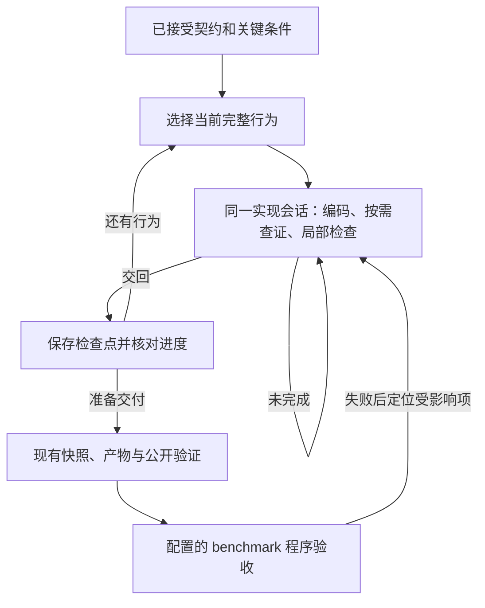

# 借鉴 Driver Port Lab：减少契约遗漏与实现返工

日期：2026-10-02。状态：已开始分批实现，进展与接口见 [benchmark 与开发工具](../workflow/BENCHMARK_AND_DELIVERY_TOOLS.zh-CN.md)。

用户后续明确：模型审查保持可选，未来期望关闭；真正验收由工作流执行 benchmark 并判断。benchmark 用例由用户团队后续设计。本轮实现可配置接口和结果校验，不新增语义审查闭环，也不把模型自写测试当作独立 benchmark。以下以这一修订为准。

## 1. 目标与依据

目标是在保持冻结范围、原始证据、运行身份和 benchmark 验收边界的前提下，减少契约理解遗漏、错误设计传播、无依据修复及重复检查。优先增强现有编码任务的输入和工具，再评估是否引入行为级调度。

本次依据两个仓库的当前工作区，而非仅依据 README：

| 仓库 | 阅读时 HEAD | 边界 |
| --- | --- | --- |
| `driver-port-factory` | `176ea7e69530d0b7d64c8aeb26ef8279586b197a` | 存在未提交改动，HEAD 不能唯一代表所读源码 |
| `../driver-port-lab` | `8616098448e968e88475e20a0c642173ff8e18bb` | 包含未提交及未跟踪的语义责任、审阅实现 |

这些标识用于定位，不是可重放的冻结快照。实际实施和对照实验前，应另行固定控制器源码、提示词、任务配置及依赖身份。本文引用 Lab 文档中的历史实验，没有重新运行它们，也没有启动付费模型或修改驱动候选。

已有相关设计见[完整交付优化](HIGH_COST_DELIVERY_OPTIMIZATION_2026-09-27.zh-CN.md)、[机制驱动工作流](MECHANISM_DRIVEN_WORKFLOW_2026-09-27.zh-CN.md)、[Skill 对齐记录](SKILL_ALIGNMENT_2026-10-02.zh-CN.md)。历史文档可能描述其他工作树或不同演进阶段，当前执行行为以实际源码为准。本文不要求恢复或删除某个框架节点，也不替代正在进行的 Skill 对齐工作。

## 2. 当前机制与剩余问题

Factory 已具备以下能力，借鉴时应复用：

- 分析报告、行为契约和测试矩阵作为编码输入；`Delivery essentials` 提供有界原文导航，详细材料按需读取。
- 框架、驱动、集成、产物和 harness 可由连续交付任务完成；账本检查点不等于独立模型调用。
- Codex 直接修改目标 worktree；控制器记录源码快照、输入摘要、报告与运行证据。
- 受控实验串行执行，依据源码、脚本、产物、环境及证据身份复用结果；支持局部场景和强制新测量。
- 实现 smoke、公开 QEMU 验证、可选独立最终审查，以及按责任阶段定向返修。
- 检查器争议处理、观察交接、Git 实验检查点与用量记录。

相关入口是 [port.py](../../src/driver_port_factory/port.py)、[implementation.py](../../src/driver_port_factory/migration/implementation.py)、[experiments.py](../../src/driver_port_factory/migration/experiments.py) 和 [final_evidence_review.py](../../src/driver_port_factory/migration/final_evidence_review.py)。

剩余风险主要是语义与反馈问题：

1. 契约及测试矩阵主要是文本，程序验证身份不等于理解全部行为要求；关键条件可能在长任务或交接中遗漏。
2. 前期接受的 API、所有权或同步设计可能只有名称映射，缺少成立前提，直到编码或运行才被推翻。
3. 实现与新写测试可能共享一个误解；正常路径通过不能证明失败恢复、并发或清理正确。
4. 模型需要自行拼接命令、等待和定位日志；超时后容易反复猜测 IRQ、锁、环境等原因。
5. 实际代码缺陷、证据不足和审查误报需要不同处理，不能都转换为改代码。

## 3. 建议一：传递关键条件与责任归属

### Lab 的做法

[Responsibility](../../../driver-port-lab/src/driver_port_lab/semantics.py) 保存条件、目标映射、需求、行为及源/目标引用。[语义提示词](../../../driver-port-lab/src/driver_port_lab/prompts/semantics.md) 要求比较：源端必须提供的保证、目标框架实际提供的保证，以及驱动需要建立的前提。责任随当前行为及相关前置关系传递，删改历史仍可供复审。

### Factory 的落点

先扩展已有契约正文和交付要点，只为会影响正确性的决策明确以下内容：

- 触发条件与必需的可观察结果或不变量。
- 目标责任由驱动、框架或双方承担。
- 框架保证成立所需的调用上下文、所有权和生命周期前提。
- 原始证据位置、尚未解决的差异，以及可区分解释的检查。

例如，“使用目标锁保护状态”不足以表达源端竞争时直接返回的语义。应记录源条件、返回/等待行为、目标锁是否阻塞，以及当前调用上下文能否接受这种差异。该例说明记录方法，不给所有驱动新增锁测试义务。

可调整的实现位置：

- `data/prompt-packs/default/analysis-task.md`：关键决策的写作要求。
- `data/prompt-packs/default/delivery-task.md`：替换源机制前核对目标保证和调用前提。
- `migration/delivery_brief.py`、`migration/decision_context.py`：在现有预算内带入相关原文及导航。

正文保持一个权威位置，不在路线、约束、交付摘要中重复完整段落。不增加第二份语义报告、固定责任数量或每函数清单。第一批不引入严格 Markdown 标题引用协议；缺少某个标题不能直接判定契约缺失。

**完成标准：** 工作包能够定位关键条件和未决差异；明确区分行为要求、已接受设计和待证假设。模型提出的映射仍是待验证判断，不能自动变成事实。若证据推翻已接受设计，沿现有修订流程处理，不静默放宽要求。

## 4. 建议二：提供直接可调用的受控检查工具

### Lab 的做法

[managed_checks.py](../../../driver-port-lab/src/driver_port_lab/managed_checks.py) 与 [check_mcp.py](../../../driver-port-lab/src/driver_port_lab/check_mcp.py) 提供 `driver_checks.check`。模型选择已有层级或场景，控制器负责执行与等待，直接返回结果和原始文件导航。工具不接受模型上传 PASS。

### Factory 的落点

在现有 [experiment_cli.py](../../src/driver_port_factory/migration/experiment_cli.py) 和 `experiments.py` 外增加薄工具接口，复用当前实验身份、串行锁、执行记录及 acknowledgment 协议。CLI 继续可用。

建议工具接口表达：

| 输入/输出 | 约束 |
| --- | --- |
| 检查层级 | 只暴露当前路线实际支持的构建、格式或运行能力，不假定所有目标都有相同命令 |
| 场景选择 | 来自已登记场景；区分工作者开发脚本与冻结验收断言 |
| 新测量请求 | 支持显式重新执行，返回是否复用及原运行身份 |
| 结果 | 执行状态、范围、超时/退出信息、receipt、全部相关场景与外部观察日志路径 |

保留有来源的编译器结构化诊断；不能只给最后一条错误或日志尾部，让模型误以为那就是根因。摘要是导航，原始日志与断言保持完整。取消、超时和子进程回收需与当前控制器生命周期一致；同一 worktree 的检查和构建串行执行。

Lab 仅复用当前进程亲自执行的完整 PASS；Factory 已有持久化、按身份复用的设计。**不直接替换成 Lab 的缓存规则。** 应单独验证新失败不会被旧 PASS 掩盖、身份变化使证据失效、局部观察不会被错误提升为全范围通过。跨重启复用继续按 Factory 已声明的证据边界处理。

**完成标准：** 一次工具调用返回检查结果，模型无需重复轮询；复用与新执行清楚区分；工具入口不能绕过现有产物和验收验证。

## 5. 建议三：提供按需 guest 调试

Lab 的 [QemuDebugger](../../../driver-port-lab/src/driver_port_lab/debugging.py) 从最近真实检查定位运行场景，沿既有环境重放，采集各虚拟 CPU 的栈、寄存器和当前位置。诊断独立保存，不产生验收通过。

Factory 可先支持已测量的 Asterinas/QEMU 路线：

1. 从控制器记录选择场景、镜像、运行命令和对应符号文件。
2. 按需启用 QEMU/GDB 采样，保存延迟、源码/产物身份、调试配置及原始输出。
3. 将诊断导航交给当前实现会话，不新增诊断模型或必经阶段。
4. 修复后仍执行普通检查；诊断本身不提供 PASS，若改变运行输入则使相关复用失效。

先明确受支持的适配器和能力，不为不支持的目标静默安装工具或改变环境。Factory 原有环境恢复仍沿自己的规则执行，不能借调试功能绕过已选路线。

**完成标准：** 已知等待的独立测试程序可采集到匹配位置；真实挂起案例能走通模型调用、读证据、修正判断、正常检查的链路。两个相同 PC 不自动证明死锁，重放栈不冒充原超时瞬间的现场。

## 6. 建议四：试点行为级编码调度

### Lab 的做法

[planning.py](../../../driver-port-lab/src/driver_port_lab/planning.py) 区分主路线 `main_route` 与行为 `behaviors`，通过 `build_plan()`、`select_next()` 和 `work_packet()` 调度。显式不可分割关系与依赖环合并为同一单元；当前项未完成就继续；设计敏感项及其前置链优先。内容 key 变化要求核对相关进度，代码不被删除。

[runner.py](../../../driver-port-lab/src/driver_port_lab/runner.py) 在交回时保存 Git 检查点。模型的 `done` 只记录 IMPLEMENTED，全部计划完成后仍须独立验收。

### Factory 的试点边界

将行为进度作为现有编码任务内部的控制状态，不为每个行为新增外层 DAG 节点、报告或审阅模型。保持框架适配、驱动、必要测试入口和产物的连续交付职责。

上图为显式启用的试点方向，不是当前默认调度。模型审查可以关闭，benchmark 通过是配置该接口后的验收依据。行为是有意义的可观察结果，不等同于一个 C/Rust 函数。主路径应包含必需的失败、资源清理和生命周期；小驱动允许只有一个行为。Markdown 编号步骤不自动生成任务，共享状态也不自动要求把所有消费者合并。

动态修订保留工作树、会话、正确实现和历史检查点，只核对实质变化及受影响依赖。引用位置、提示文案等变化不应自动清空实现进度；哪些字段进入语义 key 必须有明确边界，不能声称内容摘要可以自动识别所有语义等价改写。

Factory 已有 [Git 检查点](../../src/driver_port_factory/checkpoints.py)，可评估复用其源码快照机制；现有实验检查点要求闲置/锁边界，不能未经适配直接在活跃编码回合调用整套接口。

**完成标准：** 未完成不推进；一次完成只推进所选单元；前置未满足不能跳过；修订不丢代码；IMPLEMENTED 不产生验收 PASS。对照中还需证明新增交接成本没有抵消返工收益，之后才考虑默认启用。

## 7. 修订：benchmark 程序验收，模型审查可选

原建议中的“新增逐项语义审阅、反驳与复审闭环”已取消实施。Lab 的相关实现和失败案例仍作为研究资料，不新增 reviewer 节点、审阅表格或强制审查依赖。

新的落点是用户团队定义的 benchmark：

- 新项目通过配置固定 benchmark 命令、输入文件摘要、环境及必测项，不能由实现模型缩减必测项或改弱断言。
- 控制器执行适配器，保存命令、退出/超时状态、原始日志和每项结果。
- 每个必测项必须实际返回 PASS 和正数断言计数；漏项、重复、跳过、零断言、旧候选身份或非零退出不能通过。
- 模型审查不是 benchmark 的替代者，检查器争议协议不能让模型覆盖 benchmark 失败。
- benchmark 失败先保留现场，按实际原因选择代码、产物、环境或 benchmark 接入修复。失败不自动证明驱动错误。
- 未配置 benchmark 的已有项目保留原有公开验证范围，不能重新标记为已通过独立 benchmark。

适配器负责用例刺激及断言真实性；控制器负责调度、身份和结果协议。完整范围的定义由 benchmark 作者给出，不由模型生成的契约清单单方面决定。本地同账号进程不构成防恶意篡改隔离。

模型审查现有开关保持可选；文档中的独立评价指后续研究质量评估，不是新增运行门禁。

## 8. Lab 的实验证据及不能外推的结论

| 记录 | 可以支持的判断 | 不能支持的判断 |
| --- | --- | --- |
| [pvpanic 04 交接审计](../../../driver-port-lab/docs/PVPANIC_04_HANDOFF_AUDIT_2026-10-01.zh-CN.md) | 一次分析、两个行为实现回合、同一实现会话，完成冻结公开范围；该次约 8 分 43 秒 | 不能证明所有驱动的行为切分都降低费用或缺陷率 |
| [托管检查 08/09 对照](../../../driver-port-lab/docs/MANAGED_CHECKS_2026-09-30.zh-CN.md) | 实现阶段轮询 13 次降至 0；总输入约少 34%，总耗时约多 25% | 不能把 token 变化等同美元降本或整体提速；该真实运行没有触发完整 PASS 缓存复用 |
| [NE2000 调试续跑](../../../driver-port-lab/docs/QEMU_DEBUG_TOOLS_2026-10-01.zh-CN.md) | 模型自行使用栈证据，从“IRQ 未送达”转向 IRQ 回调内取锁问题，修复后通过原公开测试 | 属于工具升级和显式续跑后的成功，不能称作无人干预全流程或完整语义等价 |
| [NE2000 真实性审计](../../../driver-port-lab/docs/NE2K_06_AUTHENTICITY_REVIEW_2026-10-01.zh-CN.md) | 原公开测试可重复通过，但源码存在 TX/RX 存储重叠和 DMA 超时处理缺口 | PASS 不能证明并发存储隔离或未注入的失败路径；静态风险也不能冒充已复现运行故障 |
| [语义责任实施记录](../../../driver-port-lab/docs/SEMANTIC_RESPONSIBILITY_2026-10-02.zh-CN.md) | 有离线闭环、只读诊断及已知案例提示迭代记录，同时记录环境/接口失败 | 本次所查材料不足以证明新方案已有完整真实语义验收成功，或能泛化发现未知缺陷 |

Lab 的固定公开适配器和原生测试路线也值得参考：已有可信断言应冻结并复用，工作者新增测试需标明来源、刺激和判据。不要把其设备专用配方直接变成 Factory 的通用默认检查；冻结测试仍可能覆盖不足。

## 9. 实施顺序与验证

以下是实施批次；实际完成状态与能力限制见接口文档，真实 benchmark 尚待用户团队提供。

| 批次 | 内容 | 进入下一步的条件 |
| --- | --- | --- |
| A | 在已有契约/交付要点中补关键条件、责任与前提；保留原文导航 | 不新增格式返工，冻结要求与既有修复协议不变 |
| B | 受控检查工具、完整日志导航；适用路线按需 guest 调试 | 离线生命周期/证据检查通过，独立工具冒烟通过 |
| C | 行为级调度作为显式试点 | 进度、依赖、修订与检查点边界通过回归，再做真实对照 |
| D（修订） | 配置冻结的 benchmark 接口与程序验收 | 关闭模型审查仍能验收；失败、缺测及过期候选不能被模型覆盖 |

### 必要的离线验证

测试针对真实边界，不测试模型是否使用某个标题或复述某段提示词：

- 工具取消/超时能回收所属进程；检查串行，原始日志完整可定位。
- 源码、产物、oracle 或环境身份变化不能复用旧成功；新失败不能被旧 PASS 覆盖。
- 局部检查、诊断和模型自报完成不能生成全范围验收。
- 计划修订保留不相关进度与源码；变化依赖不能被已完成记录跳过。
- benchmark 缺测、零断言、失败、超时和身份变化不能通过，也不能被模型声明覆盖。
- 新协议不破坏既有连续交付、恢复、封存及角色边界。

### 真实对照

后续实验单独按授权执行。本轮实现与离线验证不启动付费模型；本地合成执行不代表真实驱动 benchmark 通过。

1. 固定源/目标 revision、模型与推理配置、环境、冻结验收范围和断言；分别建立干净候选，不能向实验组提供旧候选或具体缺陷答案。
2. 每批改动分开比较，先用小驱动验证工具/交接，再用具有多个相关行为的驱动评估调度与返工。重复采样时记录所有失败和人工介入，不能只选成功轮。
3. 已知缺陷用于开发回归；未知缺陷检出效果需新任务和独立评价。系统自身 reviewer 的通过率不能充当质量真值。
4. 优先在关闭模型审查、使用相同 benchmark 的条件下比较。若另做审阅研究，应独立计费并保持审阅预算一致，不把它混入默认验收机制。

记录指标：首次可观察行为的时间与成本、交付时独立确认的缺陷及严重性、缺陷首次发现位置、返修轮数及受影响范围、格式/接口返工、重复检查与轮询、总墙钟时间、分角色缓存/非缓存 token、已知费率估算和人工介入。未知用量保持 unknown，不按零计算；费用不能只从实现阶段转移到分析或审阅阶段后宣称下降。

推广条件是同等冻结范围下质量不退化，且返工或总成本有可解释的改善。出现行为拆分破坏生命周期、协议导致额外格式循环、benchmark 缺乏有效断言却报告成功等问题时，停止扩大试点，保留记录并修正机制。

## 10. 实施记录入口

本文保留最初对照和证据边界。实现入口、命令、协议、已完成检查及限制统一记录在 [benchmark 与开发工具](../workflow/BENCHMARK_AND_DELIVERY_TOOLS.zh-CN.md)，避免把计划状态写成真实驱动验证通过。
